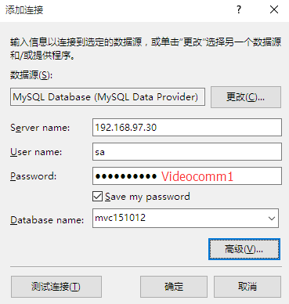

MVC 5 Identity MySQL EF6
========================

## 1. 更新EF6

	PM>Update-Package EntityFramework

## 2. 安装MySQL提供程序

PM> Install-Package MySQL.Data.Entity -Pre 

Web.config中自动添加MySQL Provider
<provider 
        invariantName="MySql.Data.MySqlClient" 
        type="MySql.Data.MySqlClient.MySqlProviderServices, MySql.Data.Entity.EF6, Version=6.9.7.0, Culture=neutral, PublicKeyToken=c5687fc88969c44d">
      </provider>

<DbProviderFactories>
      <remove invariant="MySql.Data.MySqlClient" />
      <add name="MySQL Data Provider" 
           invariant="MySql.Data.MySqlClient" 
           description=".Net Framework Data Provider for MySQL" 
           type="MySql.Data.MySqlClient.MySqlClientFactory, MySql.Data, Version=6.9.7.0, Culture=neutral, PublicKeyToken=c5687fc88969c44d" />
    </DbProviderFactories>


## 3. 在VS2013中测试MySQL连接

连接MySQL数据库



mysql属性		
		


mysql连接字符串


mysql连接字符串：

```
server=192.168.97.30;
user id=sa;
password=Videocomm1;
persistsecurityinfo=True;
database=mvc151012
```

## 4. 修改Web.config中的连接字符串

原连接字符串：
```
 <connectionStrings>
    <add name="DefaultConnection" 
    	 connectionString="
    	 	Data Source=(LocalDb)\v11.0;
    	 	AttachDbFilename=|DataDirectory|\aspnet-WebApplication5-20151012104750.mdf;
    	 	Initial Catalog=aspnet-WebApplication5-20151012104750;
    	 	Integrated Security=True" 
		 providerName="System.Data.SqlClient" />
  </connectionStrings>
```
改为：
```
<connectionStrings>
    <add name="DefaultConnection" 
         connectionString="
         	server=192.168.97.30;
         	user id=sa;
         	password=Videocomm1;
         	persistsecurityinfo=True;
         	database=mvc151012" 
         providerName="SMySql.Data.MySqlClient" />
  </connectionStrings>
```
## 5. 添加继承自HisttoryContext的定制类MySQLHistoryContext
 ```
 public class MySqlHistoryContext:HistoryContext
    {
        public MySqlHistoryContext(DbConnection exitingConnection,string defaultSchema)
            :base(exitingConnection,defaultSchema)
        { }
        protected override void OnModelCreating(System.Data.Entity.DbModelBuilder modelBuilder)
        {
            base.OnModelCreating(modelBuilder);
            modelBuilder.Entity<HistoryRow>().Property(h => h.MigrationId).HasMaxLength(100).IsRequired();
            modelBuilder.Entity<HistoryRow>().Property(h => h.ContextKey).HasMaxLength(200).IsRequired();
        }
    }
```

## 6. 添加继承自DbConfiguration的MySqlConfiguration类

```
 public class MySqlConfiguration:DbConfiguration
    {
        public MySqlConfiguration()
        {
            SetHistoryContext("MySql.Data.MySqlClient",
                (conn, schema) => new MySqlHistoryContext(conn, schema));
        }
    }
```    

## 7. 添加实现IDatabaseInitializer<ApplicationDbContext>接口的MySQLInitializer类

```
  public class MySqlInitializer:IDatabaseInitializer<ApplicationDbContext>
    {

        public void InitializeDatabase(ApplicationDbContext context)
        {
            if (!context.Database.Exists())
            {
                context.Database.Create();
            }
            else
            {
                var strQuery = var strQuery = "SELECT COUNT(*) FROM 
                	information_schema.tables WHERE table_schema = 'mvc151012' AND table_name = '__MigrationHistory'";

                var migrationHistoryTableExits
                    = ((IObjectContextAdapter)context).ObjectContext.ExecuteStoreQuery<int>(strQuery);

                if (migrationHistoryTableExits.FirstOrDefault() == 0)
                {
                    context.Database.Delete();
                    context.Database.Create();

                }
            }
        }
    }
```    

## 8. 修改Models目录中的IdentityModels.cs文件

```
  public class ApplicationDbContext : IdentityDbContext<ApplicationUser>
    {
        static ApplicationDbContext()
        {
            Database.SetInitializer(new MySqlInitializer());
        }
        public ApplicationDbContext()
            : base("DefaultConnection")
        {
        }

        public static ApplicationDbContext Create()
        {
            return new ApplicationDbContext();
        }
    }
```


## 参考资料

[《ASP.NET Identity: Using MySQL Storage with an EntityFramework MySQL Provider (C#)》](http://www.asp.net/identity/overview/getting-started/aspnet-identity-using-mysql-storage-with-an-entityframework-mysql-provider)